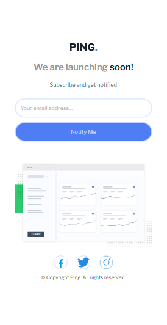

# ping-coming-soon-page-master
ping-coming-soon-page-master

This is a solution to the [ping-coming-soon-page-master challenge on Frontend Mentor](https://www.frontendmentor.io/challenges/ping-single-column-coming-soon-page-5cadd051fec04111f7b848da). Frontend Mentor challenges help you improve your coding skills by building realistic projects. 

## Table of contents

- [Overview](#overview)
  - [Screenshot](#screenshot)
  - [Links](#links)
- [My process](#my-process)
  - [Built with](#built-with)
  - [What I learned](#what-i-learned)
  - [Continued development](#continued-development)
- [Author](#author)

## Overview

### Screenshot

These are my screenshots showing how the project turned out.

- Desktop design:


- Mobile design:



- Active state:


- Error message:


### Links

- Solution URL: [My Solution](https://github.com/gillaercio/ping-coming-soon-page-master)

## My process

### Built with

- Semantic HTML5 markup
- CSS custom properties
- Nesting CSS
- Grid Layout
- Flexbox
- Mobile-first workflow

### What I learned

I took advantage of this project to practice using **nesting css**, **clamp()** with **CSS** and **preventDefault()** and **parentElement** with **JavaScript**:

Nesting CSS

```css
.content-title {
  padding-block: 10px;
  font: var(--text-lg);
  color: var(--Very-Dark-Blue);
  
  span {
    color: var(--Gray);
  }
}
```

Resizing fonts with clamp()

```css
.content-title {
  font-size: clamp(2rem, 2.2rem + 1.666vw, 3rem);
}

.content-description {
  font-size: clamp(1.2rem, 1.2rem + 1.666vw, 1.8rem);
}
```

Avoiding send message before initial validation

```js
function sendButton(event) {
  event.preventDefault();
```

Making use of parentElement

```js
const errorMessage = email.parentElement.querySelector(".error-message");
```

### Continued development

I would like to improve the use of the **HTML**, **CSS** and **JavaScript**.

## Author

- Frontend Mentor - [@gillaercio](https://www.frontendmentor.io/profile/gillaercio)
- Github - [My Github](https://github.com/gillaercio)
- LinkedIn - [My LinkedIn](https://www.linkedin.com/in/gildman-la%C3%A9rcio/)